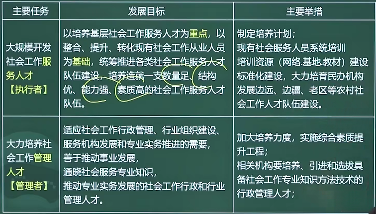

# 1.3 社会工作专业人才队伍建设中长期规划

## 社会工作专业人才队伍建设的战略目标

## 社会工作专业人才队伍建设的主要任务

- 大规模开发社火工作服务人才
- 大力培养社会工作管理人才
- 加快培养社会工作教育和研究人才

## 社会工作专业人才队伍建设体制机制与政策目标

### 建立健全社会工作专业人才管理体制机制

::: tabs

@tab 目标要求

按照党管人才原则，符合发展规律、体现中国特色的管理体制机制。

@tab 主要举措

建立各部门分工负责、协调配合的组织机制，建立联席会议制度和人才信息统计等制度；

改进人才管理方式，完善劳动关系等公共服务；

法治建设；

加大人才投入

:::

### 建立健全社会工作专业人才培养政策

::: tabs

@tab 目标要求

以国家发展和社会需求为导向，以专业化、职业化为核心，建立健全不同学历层次教育共同发展，专业培训和知识普及有机结合的社会工作专业人才培养政策。

@tab 主要举措

制定培训规划，合理配置资源，明确重点，措施保障，特殊地区关照；

加强学科专业建设

完善积极教育制度

:::

### 建立健全社会工作专业人才评价政策

::: tabs

@tab 目标要求

坚持以职业道德，能力和业绩为导向，以社会工作专业人才培育职业水平评价为基础，逐步完善符合国情，与国际接轨，科学合理的社会工作专业人才培养政策，

@tab 主要举措

- 分类管理
- 考核制度

:::

### 建立健全社会工作专业人才使用政策

::: tabs

@tab 目标要求

坚持以用为本原则；着眼于发挥社会工作专业人才作用、推动社会工作专业人才合理流动需要，以开发专职岗位和培育服务载体为重点，以畅通人才流动渠道为保障，逐步完善社会工作专业人才使用政策

@tab 主要举措

1. 建立健全相关机构岗位开发设置和人才使用政策措施
2. 加强事业单位社工岗开发和人才使用力度
3. 制定促进人才流动政策

:::

### 建立健全社会工作专业人才激励保障政策

::: tabs

@tab 目标要求

以激发社会工作专业人才积极性、稳定人才队伍、充分体现。人才价值为目标，综合运用物质激励和精神激励方式，建立健全有利于社会工作专业人才长期、安心扎根基层、服务一线的激励保障政策

@tab 主要举措

建立健全薪酬保障机制，逐步提高整体薪酬

将吸纳社工人才作为评估公益类组织的重要指标和购买服务的重要条件。

:::

## 社会工作专业人才队伍建设的重点工程

